# Secure Monitoring with Headscale and Tailscale

This guide provides a step-by-step tutorial for creating a secure, private network for your existing Prometheus monitoring stack using a self-hosted **Headscale** server on a cloud VM. By connecting your servers with **Tailscale**, you can eliminate the need to expose monitoring endpoints (like `windows_exporter`) to the public internet.

All monitoring traffic will be routed over an encrypted, private overlay network, ensuring your metrics are scraped securely and reliably.

***

## 📊 Overview of the Setup

This tutorial focuses exclusively on the networking layer. We will configure a central Headscale server to act as a control plane for a private network (a "tailnet"). Then, we will install Tailscale clients on our monitoring server and a remote Windows machine, connecting them to this network. Finally, we will update Prometheus to scrape metrics using the new, secure private IP addresses assigned by Tailscale.

### Architectural Diagram

```mermaid
graph TD
    subgraph "Your Cloud VM (e.g., GCP)"
        A[Existing Prometheus Server]
        B[Existing Grafana Server]
        C[Headscale Control Server] -- Manages --> D{Secure Tailscale Network}
        E[PostgreSQL Database] -- Stores State For --> C
        F[Tailscale Client] -- Joins --> D
        A -- Scrapes over private IP --> D
    end

    subgraph "Remote Location"
        G[Windows Server]
        H[Existing Windows Exporter]
        I[Tailscale Client] -- Joins --> D
        G --> H
    end

    style A fill:#1f2020,stroke:#333,stroke-width:2px
    style B fill:#1f2020,stroke:#333,stroke-width:2px
    style H fill:#1f2020,stroke:#333,stroke-width:2px
```



## ✅ Starting Point: What You Need First

This guide assumes you have already completed the initial setup of your monitoring tools. Before you begin, you must have:

*   **A Running Prometheus Server:** Your central Prometheus instance should be installed and running on a cloud VM.
    *   ➡️ *For setup instructions, refer to the [Prometheus setup](https://github.com/aadilahammad86/aadilahammad86/blob/main/Remote%20Configuration%20on%20the%20Prometheus%20Server%20(GCP%20VM).md).*
*   **A Running Grafana Instance:** While not strictly required for this guide, Grafana is the typical visualization tool.
    *   ➡️ *For setup instructions, refer to the [Grafana setup](https://github.com/aadilahammad86/aadilahammad86/blob/main/Initial_Setup_for_Grafana_Stack_Monitoring_(Ubuntu_GCP).md).*
*   **Metrics Exporter on Client Machine:** The `windows_exporter` (or any other exporter) must be installed and running on your target Windows server.
    *   ➡️ *For setup instructions, refer to the [Windows exporter setup](https://github.com/aadilahammad86/aadilahammad86/blob/main/Monitoring%20Remote%20Windows%20Servers.md).*

## 📋 Requirements

*   A Debian-based Linux VM (e.g., Ubuntu 22.04) with a public IP address to host Headscale.
*   A target Windows machine that you wish to monitor.
*   `sudo` or root privileges on the Linux VM.
*   Administrator privileges on the Windows machine.
*   Firewall access to open the necessary ports on your cloud VM.

| Port | Service | Purpose |
| :--- | :--- | :--- |
| `8080/TCP` | **Headscale** | Listens for connections from Tailscale clients. |

## 🚀 Step-by-Step Setup Guide

This process is broken down into three main phases.

### Phase 1: Configure the Headscale Control Plane (GCP Server)

First, we will set up the database and the Headscale server on your central Linux VM.

#### Step 1.1: Install Dependencies & PostgreSQL Database

Headscale needs a database to store network state. We'll use PostgreSQL.

1.  **Update packages and install PostgreSQL:**
    ```bash
    sudo apt update
    sudo apt install -y postgresql postgresql-contrib curl debian-keyring software-properties-common
    ```

2.  **Switch to the `postgres` system user:**
    ```bash
    sudo -i -u postgres
    ```

3.  **Create a database user for Headscale.** You will be prompted to create a secure password. **Save this password securely.**
    ```bash
    createuser headscale -P
    ```

4.  **Create the database and assign ownership:**
    ```bash
    createdb headscale -O headscale
    ```

5.  **Return to your regular user shell:**
    ```bash
    exit
    ```

#### Step 1.2: Install and Configure Headscale

1.  **Download and install the Headscale package.**
    > **Note:** Check the [Headscale GitHub Releases](https://github.com/juanfont/headscale/releases) page for the latest version and update the `HEADSCALE_VERSION` variable if needed.

    ```bash
    export HEADSCALE_VERSION="0.27.0"
    wget --output-document=headscale.deb "https://github.com/juanfont/headscale/releases/download/v${HEADSCALE_VERSION}/headscale_${HEADSCALE_VERSION}_linux_amd64.deb"
    sudo apt install -y ./headscale.deb
    ```

2.  **Stop the service before editing the configuration:**
    ```bash
    sudo systemctl stop headscale
    ```

3.  **Configure Headscale to use PostgreSQL.** Open the configuration file:
    ```bash
    sudo nano /etc/headscale/config.yaml
    ```

    Find the `database:` section (around line 142) and modify it to look like this. **Pay close attention to YAML indentation (2 spaces for `postgres:`, 4 for its children).**

    ```yaml
    database:
      type: postgres
      postgres:
        # Use the local Unix socket for simplicity and security
        host: /var/run/postgresql
        # Port is not needed when using a socket
        port: 5432
        name: headscale
        user: headscale
        pass: "<YOUR_POSTGRES_PASSWORD>" # The password you created in Step 1.1
        sslmode: "disable"
    ```

    > **💡 Pro Tip:** You also need to set the `server_url` at the top of the file to `http://<YOUR_GCP_VM_IP>:8080` and ensure `listen_addr` is `0.0.0.0:8080`.

4.  **Start and enable the Headscale service:**
    ```bash
    sudo systemctl start headscale
    sudo systemctl enable headscale
    ```

5.  **Verify that the service is running correctly:**
    ```bash
    sudo systemctl status headscale
    ```

6.  **Create a user namespace** for your nodes to register under:
    ```bash
    sudo headscale users create gcplin
    ```

### Phase 2: Build the Secure Network with Tailscale Clients

Now we will install the Tailscale client on both the server and the client machine and register them with Headscale.

#### Step 2.1: Install and Register Tailscale on the GCP Server

1.  **Add the Tailscale repository and install the client:**
    ```bash
    curl -fsSL https://pkgs.tailscale.com/stable/ubuntu/jammy.noarmor.gpg | sudo tee /usr/share/keyrings/tailscale-archive-keyring.gpg >/dev/null
    curl -fsSL https://pkgs.tailscale.com/stable/ubuntu/jammy.tailscale-keyring.list | sudo tee /etc/apt/sources.list.d/tailscale.list
    sudo apt-get update
    sudo apt-get install -y tailscale
    ```
    > **Note:** The `jammy` codename above is for Ubuntu 22.04. Replace it with your OS version if necessary (e.g., `noble` for 24.04).

2.  **Connect to your Headscale server.** This command will output a URL containing a registration key.
    ```bash
    sudo tailscale up --login-server http://127.0.0.1:8080
    ```

3.  **Register the node.** Copy the key from the output of the previous command and use it here:
    ```bash
    sudo headscale nodes register --user gcplin --key <PASTE_YOUR_KEY_HERE>
    ```

#### Step 2.2: Install and Register Tailscale on the Windows Client

1.  **Download and install** the Tailscale client for Windows:
    *   [**Download Tailscale for Windows**](https://pkgs.tailscale.com/stable/tailscale-setup-latest.exe)
    *   Run the installer. Once it completes, you can close the GUI window that appears.

2.  **Connect to your Headscale server.** Open **PowerShell as an Administrator** and run the following command. Replace `<GCP_VM_IP>` with your Headscale server's public IP address.
    ```powershell
    & "C:\Program Files\Tailscale\tailscale.exe" up --login-server http://<GCP_VM_IP>:8080
    ```

3.  **Register the Windows node.** This command will also output a URL with a key. Go back to your **GCP server's terminal** and register the Windows machine:
    ```bash
    sudo headscale nodes register --user gcplin --key <PASTE_THE_WINDOWS_KEY_HERE>
    ```

4.  **Verify the network.** On your GCP server, list the nodes to see their private Tailscale IPs.
    ```bash
    sudo headscale nodes list
    ```
    You should see both your GCP server and your Windows machine, each with an IP address like `100.64.0.X`.

### Phase 3: Integrate with Prometheus

Finally, update your Prometheus configuration to scrape metrics over the new secure network.

1.  **Edit the Prometheus configuration file** on your GCP server:
    ```bash
    sudo nano /etc/prometheus/prometheus.yml
    ```

2.  **Update the scrape job for `windows_exporter`** to use the private Tailscale IP of your Windows machine. Find the existing job and replace the `targets` with the new IP.

    ```yaml
    # /etc/prometheus/prometheus.yml

    scrape_configs:
      - job_name: "windows_exporter"
        static_configs:
          # Use the private Tailscale IP and the exporter port (9182)
          - targets: ["<WINDOWS_TAILSCALE_IP>:9182"]
            labels:
              server: "my-windows-server-01"
          # Add more targets here as you register more machines
          # - targets: ["<ANOTHER_WINDOWS_IP>:9182"]
          #   labels:
          #     server: "my-windows-server-02"
    ```

3.  **Reload Prometheus** to apply the changes:
    ```bash
    sudo systemctl reload prometheus
    ```

## ✅ Final Verification

1.  Open your Prometheus web UI by navigating to `http://<GCP_VM_IP>:5050` in your browser.
2.  Go to the **Status** > **Targets** page.
3.  Find the **`windows_exporter`** job. The endpoint should show your server's Tailscale IP (e.g., `100.64.0.2:9182`) and its state should be **UP** with a green background.

Congratulations! Prometheus is now securely scraping metrics from your remote Windows server over an encrypted, private network.
